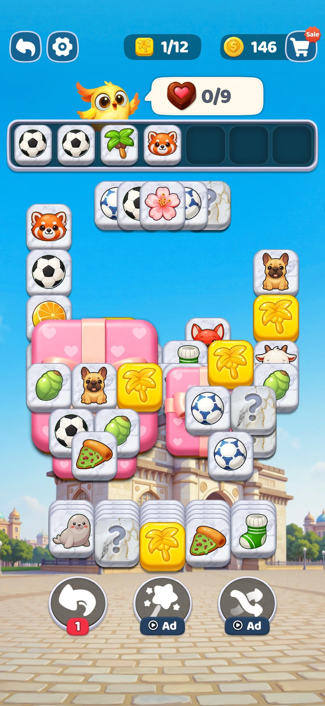

# Tile Explorer

A triple-tile match puzzle. Tap tiles from a 3D-stack into a 7-slot tray.
Match three of the same icon and they vanish. Clear the board to win.
**No ads, no IAP, no analytics, no tracking.**

<p align="center">
  
</p>

The art direction is inspired by Tile Trip — pastel sky, beveled tiles
with thick outlines, cartoon icons. All graphics are drawn procedurally
in Godot's `_draw()` (no external assets).

## Install on Android

**Direct APK download:**
https://github.com/Matswm86/tile-explorer/releases/download/latest/tile-explorer.apk

1. Open that link in your phone's browser and tap to download.
2. When you tap the downloaded file, Android may say *"For your security, your
   phone is not allowed to install unknown apps from this source."* Tap
   **Settings**, toggle **Allow from this source**, then go back and install.
3. The app appears as **Tile Explorer**.

> The APK is **debug-signed** with a stable key (stored as the
> `ANDROID_DEBUG_KEYSTORE_BASE64` GitHub secret), so reinstalling a newer
> build over an older one Just Works — no uninstall needed.

Permanent versioned downloads are also published to the
[Releases page](https://github.com/Matswm86/tile-explorer/releases) when a
`vX.Y.Z` tag is pushed.

## How to play

- Tap any **unblocked** tile (one not covered by another tile above it). It
  flies into the tray at the top of the screen.
- The tray holds **7 tiles**. Tiles auto-sort by icon so groups stay together.
- When **three tiles of the same icon** end up in the tray, they clear.
- **Win** by emptying the board with the tray empty too.
- **Lose** when the tray fills with 7 tiles that can't form a triple.

### Power-ups (3 charges each per level)

| Button | What it does |
|---|---|
| **Undo** | Sends the last tile you tapped back to the board. |
| **Clear 3** | Deletes the leftmost 3 tiles in the tray, **plus** enough matching board tiles of the same icons to keep every icon's remaining count a multiple of 3 (so the level stays solvable). |
| **Shuffle** | Randomly re-assigns the icons on remaining board tiles. |

## Run from source (desktop)

1. Install **Godot 4.6.x** from https://godotengine.org/ (single binary, no
   install needed — just extract and run).
2. Open the editor → **Import** → pick `project.godot` in this folder.
3. Press **F5** (or hit ▶). Mouse acts as touch on desktop.

## Level format

Each level is a JSON file in `data/levels/`. Coordinates are absolute pixels
referenced to a 1080×1920 viewport (the project stretch mode handles scaling
on other resolutions).

```json
{
  "level": 1,
  "tile_size": 130,
  "tiles": [
    {"icon": 0, "x": 380, "y": 580, "layer": 0},
    {"icon": 1, "x": 540, "y": 580, "layer": 0}
  ]
}
```

- `icon` is an integer index into `Icons.TABLE` in `scripts/Icons.gd` (12
  themed icons: soccer ball, apple, cat, fish, cherry, watermelon, bone,
  mushroom, ghost, banana, carrot, donut — all drawn procedurally).
- `layer` is z-order: higher layers cover lower layers. A tile is tappable
  only when no tile on a strictly higher layer overlaps its bounding box.
- Each icon must appear in a multiple of 3 (so triples can clear).

Generate or hand-author additional levels and bump `max_level` in the Game
scene to expose them.

## Difficulty curve

30 levels with progressive difficulty:

| Range | Tiles | Layers | Icons | Notes |
|-------|-------|--------|-------|-------|
| L1–L5 | 12 → 36 | 1 → 4 | 4 → 6 | Intro, simple grids |
| L6–L11 | 42 → 72 | 3 → 5 | 7 → 12 | All 12 icons unlocked at L11 |
| L12–L20 | 81 → 150 | 5 → 6 | 12 | Denser stacked piles |
| L21–L30 | 156 → 216 | 6 → 7 | 12 | Deep centred pyramids |

Levels are generated by `gen_levels.py` (centred-pyramid layouts, where
each upper layer is smaller and centred over the layer below — peeling
back outer rings reveals the inner core).

## CI builds (how the APK gets made)

Every push to `main` triggers `.github/workflows/build-android.yml`, which:

1. Spins up `ubuntu-latest`, installs Java 17 + Android SDK.
2. Downloads Godot 4.6.2 headless + Android export templates.
3. Decodes the stable debug keystore from the `ANDROID_DEBUG_KEYSTORE_BASE64`
   secret (falls back to generating an ephemeral keystore if the secret
   isn't set, so forks still build).
4. Writes `editor_settings-4.6.tres` and the build template marker files.
5. Runs `godot --headless --export-debug "Android" tile-explorer.apk`.
6. Uploads the APK as a workflow artifact, **and** updates the rolling
   `latest` pre-release on the Releases page.

For a permanent versioned APK: `git tag v0.1.0 && git push --tags`.

The full debugging history of this workflow lives in `ball-connect`'s
[`docs/godot-android-ci-notes.md`](https://github.com/Matswm86/ball-connect/blob/main/docs/godot-android-ci-notes.md)
— same workflow, same gotchas.

## File map

```
project.godot                   Engine settings (1080×1920 portrait, GL Compat)
export_presets.cfg              Android export preset (gradle build, arm64-v8a)
icon.svg                        App icon
.github/workflows/
  build-android.yml             CI workflow that produces the APK
scenes/
  Game.tscn                     Root scene + UI
  Tile.tscn                     Tile template (instanced per board tile)
scripts/
  GameManager.gd                State machine, level loader, power-ups, win/lose
  Board.gd                      Tile collection, blocking detection, input
  Tray.gd                       7-slot tray, triple-match logic, animations
  Tile.gd                       Tile draw + bounds
  Icons.gd                      12 shape+color icon definitions, draw helpers
data/levels/
  level_01.json                 …through level_30.json (30 levels)
```

## Design rules (locked-in defaults)

- Tile size: 130 px square. Viewport: 1080×1920 portrait.
- Tile-blocking inset: 6 px (tiles must overlap by more than this to count
  as covering) — see `Board.OVERLAP_INSET`.
- Tray sort: tiles auto-sort by `icon_id`, so same-icon tiles always end up
  adjacent. Triple-match resolves on **count**, not on adjacency.
- Power-ups reset to 3 charges at the start of each level.
- Lose condition fires the moment the tray is full **after** triple
  resolution; players who anticipate this can pre-emptively use Clear 3 or
  Undo on the previous turn.
